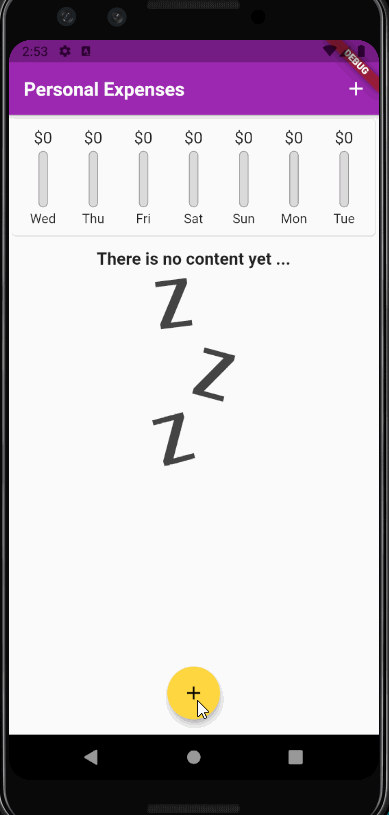

# Expenses Tracker 

A basic app to track your expenses.

## Info

This project is build with flutter...

In this project you are able to add your past transaction, and is going to track how much you have spent in the last weak.

- You are able to add transaction by adding title, amount, and the date
- You are able to see how much you have spent in a weak in a nice graph.
- You can delete transactions

## Video Walkthrough

Here's a walkthrough of implemented user stories:

GIF created with [LiceCap](http://www.cockos.com/licecap/). 

